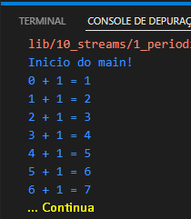
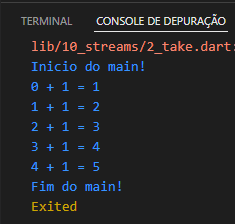
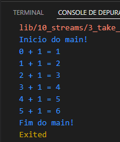
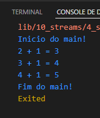
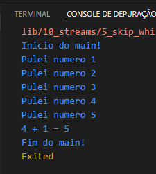
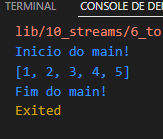
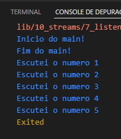
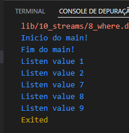
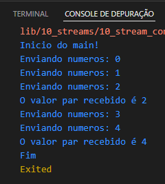

# Streams
- Streams tem as mesmas caracteristica do Future em [async](./Async.md)
- Diferente de Future, Streams pode receber varios valores em seu retorno, pois é uma combinação de Futures
- Ao abrir uma stream ela se manterar aberta ate o usuario ou uma determinação do sistema a fechar
    - Enquanto esta conexao se manter aberta pode-se enviar e receber informações por ela e para ela.
>Observação:
- Quando há uma lista a ser percorrida de modo assíncrono, nao usar o <i>forEach</i> pois o mesmo nao aceita o await, deve-se usar o <i>for in</i>.
## Stream periodic
- Stream periodic recebe um intervalo que quando concluido execulta o segundo parametro que é uma funcao
- Exemplo usado é que a cada 2 segundo, a stream chama a funcao callback
>Funcao (poderia ser uma funcao anonima dentro da propria stream (){})
```dart
int callback(int value) {
  return (value + 1);
}
```
>Intervalo
```dart
final interval = Duration(seconds: 2);
```
>Utilização 
- await for fica "escutando" a stream, e sempre que um valor novo é atribuida a ela printa o valor
- a cada 2 segundos um novo valor é atribuido a i, e este valor é exibido no print.
- em resumo é um loop infinito, porem nao consome processamento da maquina, pois o await se mantem parado aguardando um retorno da stream, nao fica rodando ifinitamente, so ira ser interrompido pelo usuario ou por uma condição imposta
```dart
final stream = Stream<int>.periodic(interval, callback);
await for (var i in stream) {
    print('Valor de i é: $i');
}
```
<i></i>

## Stream take
>Take 
- É um comando onde podemos transformar a stream
- É passado um valor inteiro que determina quantas requisições a stream ira receber
- Quando chegar a quantidade de requisições determinada a "porta" da stream é fechada.
>Seguindo dados do Stream periodic
```dart
final stream = Stream<int>.periodic(interval, callback);
// Apos 5 requisições ou seja, apos callback ser chamado 5 vezes ira encerrar a stream
stream = stream.take(5);
// await for
await for (var i in stream) {
  print('${i - 1} + 1 = $i');
}
```
<i></i>

>Take While 
- Tem o mesmo principio do take, porem nao recebe um numero inteiro e sim uma funcao onde seu retorno é uma condição
- Exemplo abaixo, ira continuar a stream enquanto o numero for menor que 6
```dart
var stream = Stream<int>.periodic(interval, callback);
// Apos 5 requisições ou seja, apos callback ser chamado 6 vezes ira encerrar a stream, pois a proxima seria igual/maior que 7
stream = stream.takeWhile((int numero) => numero < 7);
// await for
await for (var i in stream) {
  print('${i - 1} + 1 = $i');
}
```
<i></i>

## Stream Skip
>Skip
- Informa ao programa o que ira "pular", nesse caso ele pula as duas primeiras chamadas do callback
```dart
var stream = Stream<int>.periodic(interval, callback);
stream = stream.take(5).skip(2); 
await for (var i in stream) {
  print('${i - 1} + 1 = $i');
}
  ```
- Usado o take para nao manter a chamada aberta, é possivel usar o skip puro
  - ```dart
    stream = stream.skip(2); 
    ```
<i></i>

>Skip while
- Pula toda chamada enquanto a condição for atendida pelo retorno ou seja, quanto o retorno for false, no caso toda requisicao onde o numero é menor que 5.
- Usa mesma sintase do where, porem com retorno false
```dart
var stream = Stream<int>.periodic(interval, callback);
stream = stream.take(5).skipWhile((numero) {
  print('Pulei numero $numero');
  return numero < 5;
});
await for (var i in stream) {
  print('${i - 1} + 1 = $i');
}
```
- Usado o take para nao manter a chamada aberta, é possivel usar o skip puro
  - ```dart
    stream = stream.skipWhile((numero) {
      print('Pulei numero $numero');
      return numero < 5;
    });
    ```
<i></i>

## Stream toList()
>toList()
- Usado normalmente junto com uma condição de parada (take, takewhile, if, etc...)
- Não exibe o resultado final ate concluir a stream (fechar a porta)
- Salva todas as chamadas feitas e as grava em uma lista
```dart
var stream = Stream<int>.periodic(interval, callback);
stream = stream.take(5);
// Salva os valores dentro de uma lista
final data = await stream.toList();

print(data);
```
<i></i>

## Stream Listen
>listen
- O Main continua sua execução porem a porta da stream se mantem aberta
- A stream fica "escutando" o que lhe foi passado, e é executada mesmo apos o fim do main
- Usado take no exemplo apenas para nao manter um loop continuo.

```dart
var stream = Stream<int>.periodic(interval, callback);

stream = stream.take(5);
// Continua a escutar mesmo apos o fim do main
stream.listen((numero) => print('Escutei o numero $numero'));

print('Fim do main!');
```
<i></i>

## Stream where
>Where
- Aceita as requisições que atendem a determinada condição
- Ira pular requisições que nao atendem os requisitos
- Usado take no exemplo apenas para nao manter um loop continuo.
- No exemplo a stream ira aceitar requisições onde os valores sao menor que 3 ou maior que 6
  - considerando o take(5) onde, quando o total de requisições for 5 ira parar de "escutar".
- Usa a mesma sintase o skipewhile, porem seu retorno deve ser true
```dart
var stream = Stream<int>.periodic(interval, callback);
// Recebendo requisoções e salvando apenas as menores que 3 e maior que 6 num total de 5
stream = stream.where((numero) => numero < 3 || numero > 6  ).take(5);
//Funcao para exibicao dos valores apos fechar o main (topico anterior)
stream.listen((numero) => print('Escutei o numero $numero'));
print('Fim do main!');
```
<i></i>

## Stream asBroadcast
>Função callback usada neste modulo
- ```dart
  int callback(int value) {
    print('='*18);
    return (value + 1);
  }
  ```
>asBroadcastStream

- Usado para manter duas ou mais portas abertas para a stream, manter varios ouvintes...
- Usado take no exemplo apenas para nao manter um loop continuo.
- Usado asBroadcastStream para manter multiplas portas
- Mesmo usando o take() a Stream nao para de receber valores, o take esta impactando somente no listen
- Para finalizar a Stream verifica no proximo topico <b>StreamController</b>
```dart
var stream = Stream<int>.periodic(interval, callback);
stream = stream.asBroadcastStream();

stream = stream.take(3);
stream.listen((numero) => print('Listen value $numero'));

stream.listen((numero) => print('Listen value 2 $numero'));
```
<i></i>

## Stream Controller
- Não foi usado a funcao callback neste topico
- Necessario instanciar o objeto StreamController, neste exemplo ja foi instanciado como broadcast para poder notificar mais um valor, tambem foi tipado como inteiro
  - Instanciando a Stream 
    ```dart
    final streamController = StreamController <int>.broadcast();
      ```
  - Portas de entrada e saida
    ```dart
    final inStream = streamController.sink; // entrada
    final outStream = streamController.stream; // saida
    ```
- É comum definir primeiro o que ira sair, ou seja o que o outStream vai fazer com os valores de entrada.
>Valor de saida
- No exemplo, a saida é:
  - Pula o primeiro item
  - Armazena somente entradas onde seus valores sao pares
  - Transforma esses valores em string concateneda com o valor recebido
  - Escuta e printa o valor recebido/convertido
    - nesta parte poderia ser somente .listen(print), foi feito de modo completo para fins didaticos
```dart
outStream
  .skip(1)
  .where((numero) => numero % 2 == 0)
  .map((numero) => 'Guardei o valor $numero pois é par')
  .listen((strConvertida) => print(strConvertida));
```
>Valor de entrada
- No exemplo, a entrada é uma lista de 10 itens.
- De acordo com a saida, deste 10 itens apenas numeros pares serão exibidos
  - ```dart
      var numeros = [1, 2, 3, 4, 5, 6, 7, 8, 9, 10];
    ```
- O for a seguir esta adicionando cada numero da lista para a entrada da stream, no intervalo de 1 segundo.
- O for tambem vai mostrar o valor que esta sendo enviado, porem a stream ira guardar somente numero pares assim como foi definido na sua saida
  - ```dart
      for (var numero in numeros) {
        print('Enviando numeros: $numero');
        inStream.add(numero);
        await Future.delayed(Duration(milliseconds: 1000));
      } 
    ```
>Fechando conexão
- Apos conclusao do loop a stream sera fechada
```dart
await streamController.close();
```
<i></i>

## Stream Controller (Com classe)
- Não foi usado a funcao callback neste topico
- Necessario instanciar o objeto StreamController, neste exemplo ja foi instanciado como broadcast para poder notificar mais um valor, tambem foi tipado Pessoa (classe criada).
>Classe criada
```dart
class Pessoa {
  String nome;
  Pessoa({
    required this.nome,
  });
```
>Utilização
```dart
Future<void> main() async {
  final streamController = StreamController<Pessoa>.broadcast();
  final inStream = streamController.sink; // entrada
  final outStream = streamController.stream; // saida
  // Ouve o nome da pessoa na entrada e o exibe no console
  outStream.listen((nomePessoa) => print('Bem vindo ${nomePessoa.nome}'));
  // Lista de nomes que serão enviados para classe pessoa
  var nomes = ['JB', 'Graci', 'Dylan', 'Jojo'];
  // Para cada nome na lista adiciona a classe Pessoa
  for (var nome in nomes) {
    // Recebe o nome adicionado a classe Pessoa e o envia para a stream
    inStream.add(Pessoa(nome: nome));
    await Future.delayed(Duration(milliseconds: 1000));
  }
  // Fecha a stream
  await streamController.close();
}
```
<i></i>

## Stream Controller (String)
- Não foi usado a funcao callback neste topico
- Necessario instanciar o objeto StreamController, neste exemplo ja foi instanciado como broadcast para poder notificar mais um valor, tambem foi tipado String.
>Classe criada
```dart
class Pessoa {
  String nome;
  Pessoa({
    required this.nome,
  });
```
>Utilização
```dart
Future<void> main() async {
  final streamController = StreamController<String>.broadcast();
  final inStream = streamController.sink; // entrada
  final outStream = streamController.stream; // saida
  // Ouve o nome da pessoa na entrada e o exibe no console
  outStream.listen((nomePessoa) => print('Bem vindo $nomePessoa'));
  // Lista de nomes que serão enviados para classe pessoa
  var nomes = ['JB', 'Graci', 'Dylan', 'Jojo'];
  // Para cada nome na lista adiciona a classe Pessoa
  for (var nome in nomes) {
    // Recebe o nome adicionado a classe Pessoa e o envia para a stream
    inStream.add(nome));
    await Future.delayed(Duration(milliseconds: 1000));
  }
  // Fecha a stream
  await streamController.close();
}
```
<i></i>


