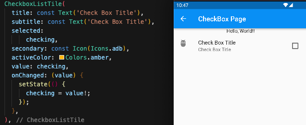

# Tela dinâmica com rolagem

## SingleChildScrollView
- Utilizado para rolar os itens na tela, evitando que ultrapassem os limites da mesma.
- Composição:
    - child: Recebe um widget.
    - scrollDirection: Direção do scroll (padrão: vertical).

---

## ListView
- Utilizado para empilhar os itens em formato de lista, evitando que ultrapassem os limites da tela.
- Composição:
    - children: Recebe uma lista de widgets.

## ListTile
- Utilizado para itens de lista.
- Composição:
    - title: Recebe um widget de texto para o título.
    - subtitle: Recebe um widget de texto para o subtítulo.
    - leading: Recebe um widget para o lado esquerdo.
    - trailing: Recebe um widget para o lado direito.

## ListView.builder()
- Utilizado para empilhar itens de um contexto, carregando-os conforme a necessidade.
- Composição:
    - shrinkWrap: Recebe um valor booleano (até o momento utilizado apenas para corrigir erros de hasSize).
    - itemCount: Recebe a quantidade de itens que terá na lista.
    - itemBuilder: Recebe uma função anônima `(context, index) {}` que retorna um widget com o conteúdo da lista, como um [CheckBoxListTile](./Scroll_List.md#checkboxlisttile), [ListTile](./Scroll_List.md#listtile) ou [RadioListTile](./Scroll_List.md#radiolisttile).

## ListView.separated
- Utilizado para empilhar itens de um contexto, carregando-os conforme a necessidade.
- Composição:
    - separatorBuilder: Recebe uma função anônima `(context, index) {}` que retorna um divisor, como um [Divider](./WidgetsTree.md#divider), ou qualquer outro widget que sirva para separar os itens, como um [CheckBoxListTile](./Scroll_List.md#checkboxlisttile) ou [RadioListTile](./Scroll_List.md#radiolisttile), por exemplo.
    - itemCount: Recebe a quantidade de itens que terá na lista.
    - itemBuilder: Recebe uma função anônima `(context, index) {}` que retorna um widget com o conteúdo da lista, como um [CheckBoxListTile](./Scroll_List.md#checkboxlisttile), [RadioListTile](./Scroll_List.md#radiolisttile) ou [ListTile](./Scroll_List.md#listtitle).

## ListBody
- Utilizado para empilhar itens em listas (um abaixo do outro).
- Composição:
    - children: Recebe uma lista de widgets que irão compor seu conteúdo empilhado.
    - reverse: Recebe `true` ou `false` para determinar a ordem dos itens na lista.

## CheckBoxListTile
- Utilizado para itens de lista.
- Exemplo:  
    - 
- Composição:
    - title: Recebe um widget de texto para o título.
    - subtitle: Recebe um widget de texto para o subtítulo.
    - selected: Recebe `true` ou `false` para os dados do título e subtítulo.
        - Exemplo: se for `true`, a cor passada em `activeColor` também terá efeito nos textos.
    - secondary: Recebe um widget que fica posicionado à esquerda.
    - activeColor: Recebe um valor de `Colors` que determina a cor da caixa

 ao ser ativada.
    - value: Valor da caixa (true ou false).
    - onChanged: Função que recebe o valor do `value` e é ativada sempre que a caixa é selecionada.

## RadioListTile
- Utilizado para itens de lista.
- Exemplo:  
    - 
- Composição:
    - value: Recebe qualquer tipo, porém esse tipo deve ser o mesmo do parâmetro em `onChanged`.
    - groupValue: Recebe a variável que irá armazenar o valor.
    - onChanged: Função que recebe o valor do `value` e é ativada sempre que o rádio é selecionado.
    - title: Recebe um widget de texto para o título.
    - subtitle: Recebe um widget de texto para o subtítulo.
    - selected: Recebe `true` ou `false` para os dados do título e subtítulo.
        - Exemplo: se for `true`, a cor passada em `activeColor` também terá efeito nos textos.
    - secondary: Recebe um widget que fica posicionado à esquerda.
    - activeColor: Recebe um valor de `Colors` que determina a cor do círculo do rádio ao ser ativado.

## SwitchListTile
- Utilizado para itens de lista.
- Exemplo:  
    - 
- Composição:
    - title: Recebe um widget de texto para o título.
    - subtitle: Recebe um widget de texto para o subtítulo.
    - selected: Recebe `true` ou `false` para os dados do título e subtítulo.
        - Exemplo: se for `true`, a cor passada em `activeColor` também terá efeito nos textos.
    - secondary: Recebe um widget que fica posicionado à esquerda.
    - activeColor: Recebe um valor de `Colors` que determina a cor do toggle switch ao ser ativado.
    - value: Valor do switch (true ou false).
    - onChanged: Função que recebe o valor do `value` e é ativada sempre que o toggle switch é selecionado.
